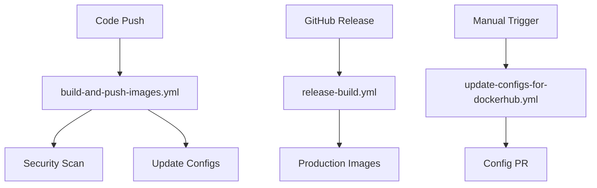

# GitHub Actions Workflows

This directory contains CI/CD workflows for building, securing, and deploying the Dashboard application.

## 🚀 Workflows Overview

### 1. **`build-and-push-images.yml`** - Main CI/CD Pipeline
**Triggers:**
- Push to `main` or `develop` branches
- Pull requests to `main`
- Manual dispatch

**Features:**
- **Advanced Code Obfuscation**: JavaScript and Python code obfuscation
- **Multi-Service Builds**: Frontend, Nexus, Schema Service
- **Multi-Architecture**: Builds for `linux/amd64` and `linux/arm64`
- **Security Scanning**: Trivy vulnerability scanning
- **Auto-Updates**: Updates deployment configs with new image tags

**Services Built:**
- `actyze/dashboard-frontend` - React frontend with nginx
- `actyze/dashboard-nexus` - FastAPI backend service
- `actyze/dashboard-schema-service` - FAISS schema recommendations

### 2. **`release-build.yml`** - Production Release Pipeline
**Triggers:**
- GitHub releases (published)
- Manual dispatch with version input

**Features:**
- **Production-Grade Obfuscation**: Advanced security hardening
- **Release Versioning**: Semantic versioning support
- **Release Notes**: Auto-generated changelog
- **Stable Tags**: Creates `latest` and `stable` tags

**Security Enhancements:**
- Domain locking for frontend
- Debug protection
- Self-defending code
- Advanced identifier mangling
- String encryption

### 3. **`update-configs-for-dockerhub.yml`** - Configuration Management
**Triggers:**
- Manual dispatch

**Features:**
- Updates Docker Compose files to use Docker Hub images
- Updates Helm values for Docker Hub repositories
- Creates pull requests with configuration changes
- Supports `latest`, `stable`, and specific version tags

## 🔧 Required Secrets

Configure these secrets in your GitHub repository:

```bash
# Docker Hub credentials
DOCKER_USERNAME=your-dockerhub-username
DOCKER_PASSWORD=your-dockerhub-token-or-password

# GitHub token (automatically provided)
GITHUB_TOKEN=<auto-generated>
```

## 🛡️ Security Features

### Code Obfuscation

#### **JavaScript (Frontend)**
- Control flow flattening
- Dead code injection
- String array encoding (RC4)
- Debug protection
- Self-defending code
- Domain locking
- Console output disabling

#### **Python (Nexus & Schema Service)**
- PyArmor commercial-grade obfuscation
- Runtime protection
- Anti-debugging measures
- Code encryption
- Import protection


### Container Security
- Trivy vulnerability scanning
- Multi-stage builds
- Minimal base images
- Security-hardened configurations

## 📋 Usage Examples

### Trigger Main Build
```bash
# Automatic on push to main/develop
git push origin main

# Manual trigger
gh workflow run build-and-push-images.yml
```

### Create Production Release
```bash
# Create GitHub release (triggers automatically)
gh release create v1.0.0 --title "Release v1.0.0" --notes "Production release"

# Manual trigger
gh workflow run release-build.yml -f version=v1.0.0
```

### Update Deployment Configs
```bash
# Update to latest images
gh workflow run update-configs-for-dockerhub.yml -f update_type=latest

# Update to stable images
gh workflow run update-configs-for-dockerhub.yml -f update_type=stable

# Update to specific version
gh workflow run update-configs-for-dockerhub.yml -f update_type=specific_version -f version=v1.0.0
```

## 🏗️ Build Process

### 1. **Code Preparation**
- Checkout source code
- Set up language-specific environments
- Install obfuscation tools

### 2. **Advanced Obfuscation**
- Language-specific obfuscation
- Security hardening
- Debug information removal
- Source map elimination

### 3. **Docker Build**
- Multi-architecture builds
- Layer caching optimization
- Security scanning
- Push to Docker Hub

### 4. **Configuration Updates**
- Update Docker Compose files
- Update Helm values
- Create pull requests
- Update documentation

## 📊 Image Tags Strategy

### Development Images
- `main` - Latest main branch build
- `develop` - Latest develop branch build
- `pr-123` - Pull request builds
- `main-abc1234` - Commit-specific builds

### Production Images
- `v1.0.0` - Specific version releases
- `latest` - Latest stable release
- `stable` - Production-ready stable version

## 🔍 Monitoring and Debugging

### View Workflow Runs
```bash
# List recent workflow runs
gh run list

# View specific run details
gh run view <run-id>

# View logs for specific job
gh run view <run-id> --log
```

### Check Image Status
```bash
# Check if images are available
docker pull actyze/dashboard-frontend:latest
docker pull actyze/dashboard-nexus:latest
docker run --rm actyze/dashboard-nexus:latest
docker pull actyze/dashboard-schema-service:latest
```

### Verify Obfuscation
```bash
# Extract and examine obfuscated code
docker run --rm actyze/dashboard-frontend:latest cat /usr/share/nginx/html/static/js/main.*.js | head -n 10
```

## 🚨 Troubleshooting

### Common Issues

#### **Build Failures**
1. Check Docker Hub credentials
2. Verify obfuscation tool availability
3. Check disk space and memory limits
4. Review build logs for specific errors

#### **Obfuscation Issues**
1. Ensure source code compatibility
2. Check obfuscation tool versions
3. Verify configuration files
4. Test with simpler obfuscation settings

#### **Push Failures**
1. Verify Docker Hub permissions
2. Check repository names
3. Ensure multi-architecture support
4. Verify network connectivity

### Debug Commands
```bash
# Test obfuscation locally
npm install -g javascript-obfuscator
javascript-obfuscator input.js --output output.js --compact true

# Test Docker build locally
docker build -f docker/Dockerfile.frontend -t test-frontend .

# Check image layers
docker history actyze/dashboard-frontend:latest
```

## 📚 Additional Resources

- **[Docker Hub Organization](https://hub.docker.com/u/actyze)** - Published images
- **[GitHub Actions Documentation](https://docs.github.com/en/actions)** - Official docs
- **[Docker Buildx](https://docs.docker.com/buildx/)** - Multi-platform builds
- **[Trivy Scanner](https://trivy.dev/)** - Vulnerability scanning

## 🔄 Workflow Dependencies



## 🎯 Best Practices

1. **Always test locally** before pushing to main
2. **Use semantic versioning** for releases
3. **Review security scan results** before deployment
4. **Keep secrets secure** and rotate regularly
5. **Monitor build times** and optimize as needed
6. **Test multi-architecture** images on different platforms
7. **Verify obfuscation effectiveness** regularly
