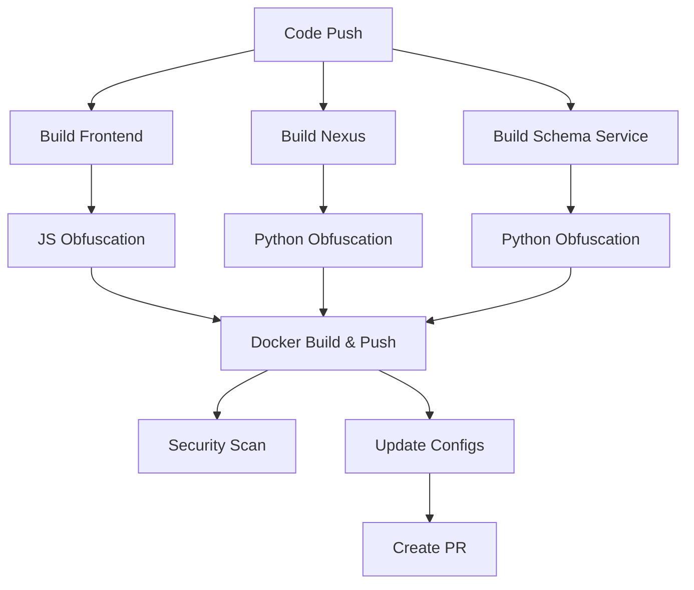

# GitHub Actions CI/CD Setup Guide

This guide explains how to set up and use the GitHub Actions CI/CD pipeline for the Dashboard application, including advanced code obfuscation and Docker Hub integration.

## 🎯 Overview

The GitHub Actions pipeline provides:
- **Automated Docker image builds** for all services
- **Advanced code obfuscation** for security
- **Multi-architecture support** (amd64, arm64)
- **Security vulnerability scanning**
- **Automatic deployment configuration updates**
- **Docker Hub integration** for pre-built images

## 🚀 Quick Setup

### 1. **Configure Secrets**
```bash
# Run the setup script
./scripts/setup-github-secrets.sh

# Or manually set secrets in GitHub UI:
# Settings > Secrets and variables > Actions
```

**Required Secrets:**
- `DOCKER_USERNAME` - Your Docker Hub username
- `DOCKER_PASSWORD` - Your Docker Hub access token (recommended) or password

### 2. **Trigger First Build**
```bash
# Push to main branch (triggers automatically)
git push origin main

# Or trigger manually
gh workflow run build-and-push-images.yml
```

### 3. **Monitor Progress**
```bash
# View workflow runs
gh run list

# View specific run
gh run view <run-id>
```

## 🏗️ Pipeline Architecture

### **Main Pipeline** (`build-and-push-images.yml`)


### **Services Built**
| Service | Image | Description |
|---------|-------|-------------|
| Frontend | `actyze/dashboard-frontend` | React app with nginx, obfuscated JS |
| Nexus | `actyze/dashboard-nexus` | FastAPI backend, obfuscated Python |
| Schema Service | `actyze/dashboard-schema-service` | FAISS service, obfuscated Python |

## 🛡️ Security Features

### **Code Obfuscation**

#### **JavaScript (Frontend)**
- **Control flow flattening** - Makes code flow harder to follow
- **String array encoding** - Encrypts strings with RC4
- **Dead code injection** - Adds fake code paths
- **Debug protection** - Prevents debugging tools
- **Self-defending code** - Detects tampering attempts
- **Domain locking** - Restricts execution to specific domains

#### **Python (Nexus & Schema Service)**
- **PyArmor obfuscation** - Commercial-grade Python protection
- **Runtime protection** - Anti-debugging measures
- **Import protection** - Secures module imports
- **Code encryption** - Encrypts Python bytecode

### **Container Security**
- **Trivy vulnerability scanning** - Detects security issues
- **Multi-stage builds** - Reduces attack surface
- **Minimal base images** - Alpine/distroless images
- **Non-root execution** - Security best practices

## 📋 Workflow Triggers

### **Automatic Triggers**
```bash
# Main CI/CD pipeline
git push origin main        # ✅ Triggers build
git push origin develop     # ✅ Triggers build
# Pull request to main      # ✅ Triggers build

# Release pipeline
gh release create v1.0.0    # ✅ Triggers release build
```

### **Manual Triggers**
```bash
# Build and push images
gh workflow run build-and-push-images.yml

# Release build with version
gh workflow run release-build.yml -f version=v1.0.0

# Update deployment configs
gh workflow run update-configs-for-dockerhub.yml -f update_type=latest
```

## 🏷️ Image Tagging Strategy

### **Development Images**
- `main` - Latest main branch
- `develop` - Latest develop branch  
- `pr-123` - Pull request builds
- `main-abc1234` - Commit-specific builds

### **Production Images**
- `v1.0.0` - Specific version releases
- `latest` - Latest stable release
- `stable` - Production-ready version

## 🔧 Using Pre-built Images

### **Docker Compose**
The pipeline automatically updates Docker Compose files to use Docker Hub images:

```yaml
# Before (builds locally)
services:
  dashboard-nexus:
    build:
      context: ./nexus
      dockerfile: Dockerfile

# After (uses Docker Hub)
services:
  dashboard-nexus:
    image: actyze/dashboard-nexus:latest
```

### **Helm Charts**
Helm values are updated to use Docker Hub repositories:

```yaml
# Before (local images)
nexus:
  image:
    repository: dashboard-nexus
    pullPolicy: Never

# After (Docker Hub images)
nexus:
  image:
    repository: roman1887/dashboard-nexus
    pullPolicy: Always
```

### **Deployment Commands**
```bash
# Docker Compose (uses pre-built images)
./scripts/docker-start.sh local -d

# Helm (pulls from Docker Hub)
helm install dashboard ./helm/dashboard -f ./helm/dashboard/values-dev.yaml -n dashboard
```

## 📊 Monitoring and Debugging

### **View Workflow Status**
```bash
# List recent runs
gh run list --limit 10

# View specific run details
gh run view 1234567890

# View logs for specific job
gh run view 1234567890 --log --job build-frontend
```

### **Check Docker Hub Images**
```bash
# Pull and inspect images
docker pull actyze/dashboard-schema-service:latest
docker inspect actyze/dashboard-frontend:latest

# Test image locally
docker run -p 3000:3000 actyze/dashboard-frontend:latest

# Check JavaScript obfuscation
docker run --rm actyze/dashboard-frontend:latest \
  cat /usr/share/nginx/html/static/js/main.*.js | head -n 5

# View image layers
docker history actyze/dashboard-frontend:latest

# Check Python obfuscation
docker run --rm actyze/dashboard-nexus:latest \
  ls -la /app/pyarmor_runtime_*
```

### **Verify Obfuscation**
```bash
# Check JavaScript obfuscation
docker run --rm actyze/dashboard-frontend:latest \
  cat /usr/share/nginx/html/static/js/main.*.js | head -n 5

# Check Python obfuscation
docker run --rm actyze/dashboard-nexus:latest \
  ls -la /app/pyarmor_runtime_*
```

## 🚨 Troubleshooting

### **Common Issues**

#### **Build Failures**
```bash
# Check workflow logs
gh run view <run-id> --log

# Common causes:
# - Docker Hub authentication failure
# - Obfuscation tool errors
# - Resource limitations
# - Network connectivity issues
```

#### **Obfuscation Failures**
```bash
# Test obfuscation locally
npm install -g javascript-obfuscator
javascript-obfuscator test.js --output test.obf.js

pip install pyarmor
pyarmor gen --output obfuscated/ source.py
```

#### **Push Failures**
```bash
# Verify Docker Hub credentials
docker login

# Check repository permissions
# Ensure repository exists on Docker Hub
# Verify multi-architecture support
```

### **Debug Commands**
```bash
# Test Docker build locally
docker build -f docker/Dockerfile.frontend -t test-frontend .

# Check GitHub secrets
gh secret list

# Validate workflow syntax
gh workflow view build-and-push-images.yml
```

## 🔄 Maintenance

### **Regular Tasks**

#### **Update Dependencies**
```bash
# Update GitHub Actions versions
# Update obfuscation tools
# Update base Docker images
# Review security scan results
```

#### **Rotate Secrets**
```bash
# Generate new Docker Hub access token
# Update GitHub secrets
./scripts/setup-github-secrets.sh
```

#### **Monitor Performance**
```bash
# Check build times
gh run list --json createdAt,conclusion,updatedAt

# Monitor image sizes
docker images roman1887/dashboard-*

# Review security scan results
# Check Trivy reports in GitHub Security tab
```

## 📚 Advanced Usage

### **Custom Obfuscation Settings**
Modify the workflow files to adjust obfuscation parameters:

```yaml
# .github/workflows/build-and-push-images.yml
- name: Obfuscate JavaScript code
  run: |
    javascript-obfuscator "$file" --output "$file" \
      --compact true \
      --control-flow-flattening-threshold 0.75 \
      # Add custom parameters here
```

### **Multi-Environment Deployments**
```bash
# Deploy to different environments
gh workflow run update-configs-for-dockerhub.yml \
  -f update_type=specific_version \
  -f version=v1.0.0-staging

gh workflow run update-configs-for-dockerhub.yml \
  -f update_type=stable  # Production
```

### **Custom Release Process**
```bash
# Create pre-release
gh release create v1.0.0-rc1 --prerelease \
  --title "Release Candidate 1.0.0" \
  --notes "Pre-release for testing"

# Promote to stable
gh release edit v1.0.0-rc1 --prerelease=false
```

## 🎯 Best Practices

1. **Security**
   - Use Docker Hub access tokens instead of passwords
   - Regularly rotate secrets
   - Review security scan results
   - Keep obfuscation tools updated

2. **Performance**
   - Monitor build times and optimize
   - Use layer caching effectively
   - Clean up old images regularly
   - Monitor resource usage

3. **Reliability**
   - Test workflows in development branches
   - Use semantic versioning for releases
   - Maintain comprehensive logs
   - Have rollback procedures ready

4. **Maintenance**
   - Keep workflows updated
   - Monitor for deprecated actions
   - Review and update obfuscation settings
   - Document any customizations

## 📖 Additional Resources

- **[GitHub Actions Documentation](https://docs.github.com/en/actions)**
- **[Docker Hub Documentation](https://docs.docker.com/docker-hub/)**
- **[Workflow Files](.github/workflows/README.md)**
- **[Docker Deployment Guide](docker/DEPLOYMENT.md)**
- **[Main Project README](README.md)**

---

## 🆘 Getting Help

If you encounter issues:

1. **Check workflow logs**: `gh run view <run-id> --log`
2. **Review this documentation**: Especially troubleshooting section
3. **Test locally**: Build and test images on your machine
4. **Check GitHub status**: https://www.githubstatus.com/
5. **Verify secrets**: Ensure all required secrets are set correctly

For advanced support, review the workflow files in `.github/workflows/` and customize as needed for your specific requirements.
