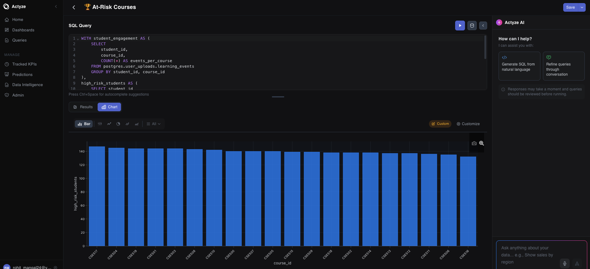

# Actyze

**Open-source, self-hosted AI analytics platform.** Natural language to SQL across 50+ languages, federated queries via Trino, no-code ML predictions, voice queries, and 100+ LLM providers via LiteLLM.



[Documentation](https://docs.actyze.io) · [Quick Start](#quick-start) · [Discord](#) · [Report an issue](https://github.com/actyze/dashboard/issues)

[](LICENSE)
[](https://www.python.org/)
[](https://github.com/actyze/dashboard/stargazers)
[](https://github.com/actyze/dashboard/releases)
[](https://github.com/actyze/dashboard/issues)
[](https://github.com/actyze/dashboard/graphs/contributors)

---

## Why Actyze

Actyze is built for three teams:

- **For teams already running Trino.** Actyze is the AI/BI layer Trino has been missing. Plug it in front of an existing Trino cluster, point it at your catalogs, and get natural-language queries, dashboards, and ML predictions on top of the federation you already have. No data movement, no rewrites.

- **For Metabase or Superset users.** Add natural-language querying and no-code ML predictions without ripping out your stack. Actyze can run alongside your existing BI tool and federate the same sources, so you get LLM-driven exploration and forecasting without migrating dashboards or retraining users.

- **For teams leaving Snowflake Cortex or Databricks Genie.** The same AI capabilities — text-to-SQL, semantic understanding, predictions — on your own infrastructure, with no per-credit pricing and no vendor lock-in. AGPL v3, self-hosted, and your data never leaves your network.

## Key Features

- **Natural language to SQL** — ask questions in plain English (50+ languages), get SQL and visualizations
- **Federated querying via Trino** — connect PostgreSQL, MySQL, MongoDB, Snowflake, BigQuery, and more from a single query
- **Semantic intelligence layer** — persistent relationship graph with convention inference, query history mining, and admin curation for accurate JOINs
- **No-code ML predictions** — forecast, classify, and estimate using XGBoost, LightGBM, and AutoGluon workers
- **Scheduled KPIs (gold layer)** — pre-aggregate metrics on a 1–24h schedule, materialized as real queryable tables
- **100+ LLM providers via LiteLLM** — Anthropic, OpenAI, Gemini, Groq, Together, Perplexity, or any OpenAI-compatible endpoint

## Quick Start

```bash
git clone https://github.com/actyze/dashboard.git
cd dashboard/docker
cp env.example .env
# Edit .env — add your LLM API key (Anthropic, OpenAI, etc.)
./start.sh
```

- Frontend: http://localhost:3000
- API: http://localhost:8000

Default login: `nexus_admin` / `admin` (change before exposing the instance).

See [docker/README.md](docker/README.md) for profiles (local, external Trino, postgres-only) and [docker/LLM_PROVIDERS.md](docker/LLM_PROVIDERS.md) for provider setup.

## Architecture

```
Frontend (React) --> Nexus API (FastAPI) --> Trino --> Your Databases
                         |
                   Schema Service (FAISS) + Relationship Graph (PostgreSQL)
                         |
                   LLM Provider (Claude, GPT, etc., via LiteLLM)
                         |
                   Prediction Workers (XGBoost / LightGBM / AutoGluon)
```

| Component | Technology |
|---|---|
| Frontend | React 18, Material-UI, Plotly |
| Backend (Nexus) | FastAPI, Python 3.11, SQLAlchemy async |
| Schema Service | FAISS vector search, spaCy NER |
| Query Engine | Trino (federated SQL) |
| Database | PostgreSQL 15 |
| LLM Gateway | LiteLLM (100+ providers) |
| Prediction Workers | XGBoost, LightGBM, AutoGluon |

## See it in action

- Live docs and walkthroughs: [docs.actyze.io](https://docs.actyze.io)
- Demo videos: **TODO** — host `Actyze_ Data Clarity.mp4` and `Actyze_ Federated Querying.mp4` (e.g., upload to a GitHub issue/release asset or YouTube) and link them here.

## Documentation

- [Docker deployment](docker/README.md)
- [LLM providers](docker/LLM_PROVIDERS.md)
- [Database migrations](DATABASE_MIGRATIONS.md)
- [External Trino setup](EXTERNAL_TRINO_SETUP.md)
- [External LLM setup](EXTERNAL_LLM_SETUP.md)
- [Schema exclusion feature](SCHEMA_EXCLUSION_FEATURE.md)
- [Predictive intelligence test plan](PREDICTIVE_INTELLIGENCE_TEST_PLAN.md)
- [Contributing](CONTRIBUTING.md)
- [Security policy](SECURITY.md)

## Contributing

We welcome contributions. See [CONTRIBUTING.md](CONTRIBUTING.md) for setup, branch conventions, the CLA, and where help matters most (synonym packs, relationship heuristics, verified query templates, KPI definitions).

## License

[AGPL v3](LICENSE)
