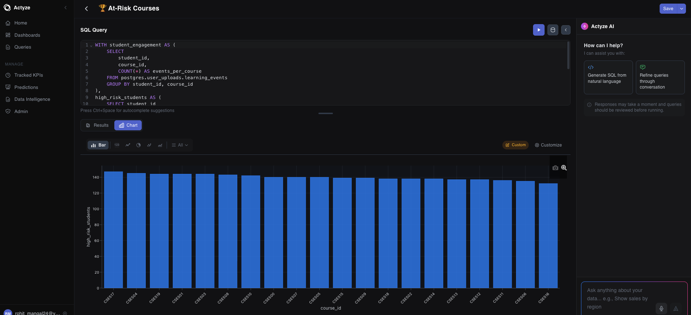

[English](README.md) · [Français](README.fr.md)
# Actyze

**Open-source, self-hosted AI analytics platform.** Natural language to SQL across 50+ languages, federated queries via Trino, no-code ML predictions, voice queries, and 100+ LLM providers via LiteLLM.



[Website](https://actyze.ai) · [Documentation](https://docs.actyze.io) · [Quick Start](#quick-start) · [Helm charts](https://github.com/actyze/helm-charts) · [Docker Compose](https://github.com/actyze/dashboard-docker) · [Discussions](https://github.com/actyze/dashboard/discussions)

[](LICENSE)
[](https://www.python.org/)
[](https://github.com/actyze/dashboard/stargazers)
[](https://github.com/actyze/dashboard/releases)
[](https://github.com/actyze/dashboard/issues)
[](https://github.com/actyze/dashboard/graphs/contributors)

---

## Why Actyze

Actyze is built for three teams:

- **For teams already running Trino.** Actyze is the AI/BI layer Trino has been missing. Plug it in front of an existing Trino cluster, point it at your catalogs, and get natural-language queries, dashboards, and ML predictions on top of the federation you already have. No data movement, no rewrites.

- **For Metabase or Superset users.** Add natural-language querying and no-code ML predictions without ripping out your stack. Actyze can run alongside your existing BI tool and federate the same sources, so you get LLM-driven exploration and forecasting without migrating dashboards or retraining users.

- **For teams leaving Snowflake Cortex or Databricks Genie.** The same AI capabilities — text-to-SQL, semantic understanding, predictions — on your own infrastructure, with no per-credit pricing and no vendor lock-in. AGPL v3, self-hosted, and your data never leaves your network.

## Key Features

- **Natural language to SQL** — ask questions in plain English (50+ languages), get SQL and visualizations
- **Federated querying via Trino** — connect PostgreSQL, MySQL, MongoDB, Snowflake, BigQuery, and more from a single query
- **Semantic intelligence layer** — persistent relationship graph with convention inference, query history mining, and admin curation for accurate JOINs
- **No-code ML predictions** — forecast, classify, and estimate using XGBoost, LightGBM, and AutoGluon workers
- **Scheduled KPIs (gold layer)** — pre-aggregate metrics on a 1–24h schedule, materialized as real queryable tables
- **100+ LLM providers via LiteLLM** — Anthropic, OpenAI, Gemini, Groq, Together, Perplexity, or any OpenAI-compatible endpoint

## Quick Start

```bash
git clone https://github.com/actyze/dashboard.git
cd dashboard/docker
cp env.example .env
# Edit .env — add your LLM API key (Anthropic, OpenAI, etc.)
./start.sh
```

- Frontend: http://localhost:3000
- API: http://localhost:8000

Default login: `nexus_admin` / `admin` (change before exposing the instance).

See [docker/README.md](docker/README.md) for profiles (local, external Trino, postgres-only) and [docker/LLM_PROVIDERS.md](docker/LLM_PROVIDERS.md) for provider setup.

## Architecture

```
Frontend (React) --> Nexus API (FastAPI) --> Trino --> Your Databases
                         |
                   Schema Service (FAISS) + Relationship Graph (PostgreSQL)
                         |
                   LLM Provider (Claude, GPT, etc., via LiteLLM)
                         |
                   Prediction Workers (XGBoost / LightGBM / AutoGluon)
```

| Component | Technology |
|---|---|
| Frontend | React 18, Material-UI, Plotly |
| Backend (Nexus) | FastAPI, Python 3.11, SQLAlchemy async |
| Schema Service | FAISS vector search, spaCy NER |
| Query Engine | Trino (federated SQL) |
| Database | PostgreSQL 15 |
| LLM Gateway | LiteLLM (100+ providers) |
| Prediction Workers | XGBoost, LightGBM, AutoGluon |

## Observability & Monitoring

Actyze follows an **emit-only** model: every service emits structured JSON logs to stdout and exposes Prometheus metrics, and you bring your own backend (Prometheus, Grafana, Datadog, Splunk, ELK, Loki — anything that scrapes `/metrics` or ingests stdout). No observability backend is bundled or required.

A shared observability library ([`shared/observability/`](shared/observability/)) provides logging, metrics, and health checks to all Python services (Nexus, Schema Service, Prediction Workers) and a JavaScript counterpart for the frontend, so every service is instrumented the same way.

**Built-in health checks (every service):**
- `/healthz` — Kubernetes liveness probe (process is up)
- `/readyz` — Kubernetes readiness probe (dependencies reachable)
- `/health` — detailed aggregated status (Nexus rolls up Schema Service, LLM, Trino, and cache)

**Metrics & logs:**
- Prometheus format at `/metrics` on each service — HTTP request rate/latency, NL-query and SQL-execution counters, prediction pipeline timings, plus standard process/runtime metrics
- JSON structured logs with propagated context variables (`request_id`, `user_id`, `query_id`, `session_id`)

**Quick start:**
```bash
# Structured logs (JSON) across services
docker logs dashboard-nexus | jq '.'
docker logs dashboard-schema-service | jq 'select(.event)'

# Aggregated health + Prometheus metrics (Nexus on :8000, Schema Service on :8001)
curl -s http://localhost:8000/health | jq '.status, .details.services[].name'
curl -s http://localhost:8000/metrics | head -30
```

> **Scope:** today's instrumentation is operational/SRE-facing (health, metrics, logs for whoever runs the deployment). End-user-facing observability — per-query execution timelines, query history with timings, cache/freshness indicators surfaced in the UI — is tracked for a future release.

See [shared/observability/docs/ARCHITECTURE.md](shared/observability/docs/ARCHITECTURE.md) for the architecture overview and integration guides.

## See it in action

- Live docs and walkthroughs: [docs.actyze.io](https://docs.actyze.io)
- Demo videos: **TODO** — host `Actyze_ Data Clarity.mp4` and `Actyze_ Federated Querying.mp4` (e.g., upload to a GitHub issue/release asset or YouTube) and link them here.

## Security

Actyze is AGPL-3.0. Everything in the images is open source — no proprietary
components, no licensed tier, no paywalled features.

- Every image runs as a **non-root user** and meets the Kubernetes **restricted**
  Pod Security Standard, apart from `readOnlyRootFilesystem`.
- A **CycloneDX SBOM** is produced for every image on every build.
- CI **fails the build** on a fixable CRITICAL/HIGH vulnerability or a
  non-open-source licence.
- **Zero fixable CRITICAL findings.** The only fixable HIGH findings are three
  CPython advisories whose sole fix is an unreleased CPython 3.15 (two of them
  only in a beta). We will not ship a pre-release interpreter for them. Each is
  waived individually in
  [security/vulnerability-allowlist.txt](security/vulnerability-allowlist.txt)
  with a reason and a review date, not suppressed by a severity threshold.
- This is **not a zero-CVE claim.** Findings with no upstream fix remain, mostly
  `perl-base` and `libc6` from the Debian base.

Verify any published image yourself:

```bash
syft actyze/dashboard-nexus:0.1.1 -o cyclonedx-json

# Expect exit 2 and three CPython HIGH findings — the waived ones above.
# Anything beyond those three is a regression worth reporting.
grype actyze/dashboard-nexus:0.1.1 --only-fixed --fail-on high
```

Details in [security/CONTAINER_SECURITY.md](security/CONTAINER_SECURITY.md) and
[security/LICENSE_REPORT.md](security/LICENSE_REPORT.md). To report a
vulnerability, see [SECURITY.md](SECURITY.md).

## Documentation

- [Docker deployment](docker/README.md)
- [LLM providers](docker/LLM_PROVIDERS.md)
- [Database migrations](DATABASE_MIGRATIONS.md)
- [External Trino setup](EXTERNAL_TRINO_SETUP.md)
- [External LLM setup](EXTERNAL_LLM_SETUP.md)
- [Schema exclusion feature](SCHEMA_EXCLUSION_FEATURE.md)
- [Predictive intelligence test plan](PREDICTIVE_INTELLIGENCE_TEST_PLAN.md)
- [Contributing](CONTRIBUTING.md)
- [Security policy](SECURITY.md)
- [Upgrading between versions](UPGRADING.md) — breaking changes and required actions
- [Container security posture](security/CONTAINER_SECURITY.md) — base images, CVE counts, SBOM
- [Open source licence report](security/LICENSE_REPORT.md) — what is in the images and under what terms

## Related Repositories

- **[actyze/helm-charts](https://github.com/actyze/helm-charts)** — production Helm charts for Kubernetes deployments
- **[actyze/dashboard-docker](https://github.com/actyze/dashboard-docker)** — Docker Compose deployment for local / single-host installs
- **[docs.actyze.io](https://docs.actyze.io)** — product documentation
- **[actyze.ai](https://actyze.ai)** — main website

## Contributing

We welcome contributions. See [CONTRIBUTING.md](CONTRIBUTING.md) for setup, branch conventions, the CLA, and where help matters most (synonym packs, relationship heuristics, verified query templates, KPI definitions).

## License

[AGPL v3](LICENSE)
